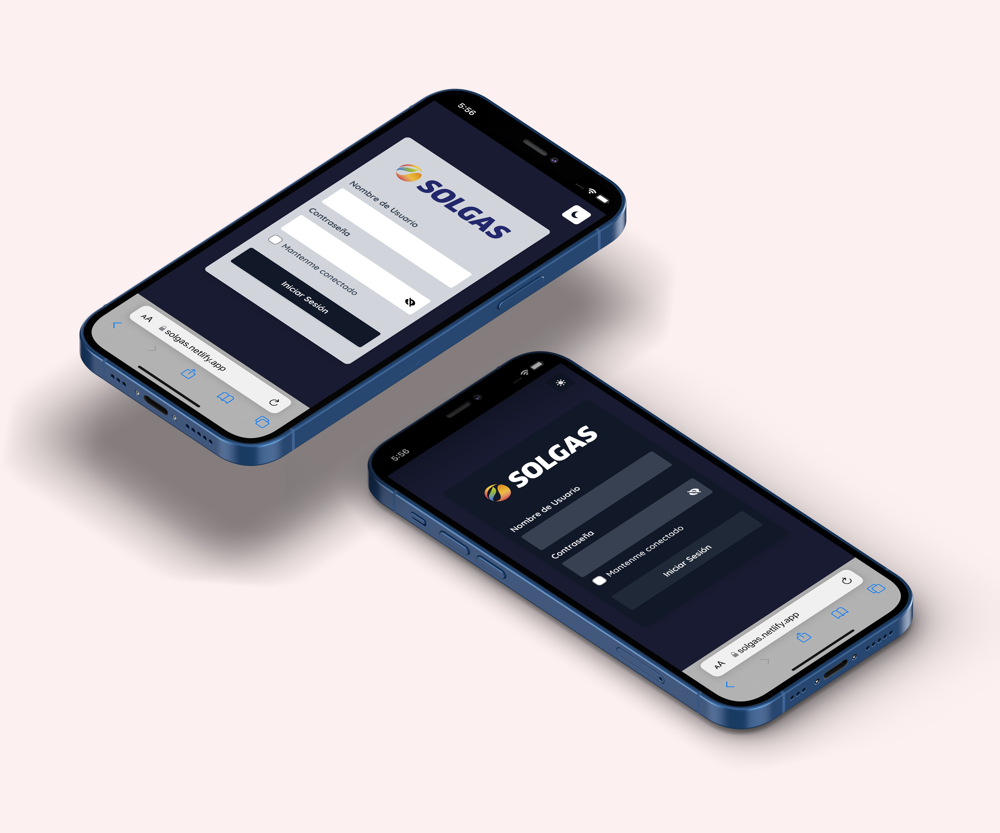
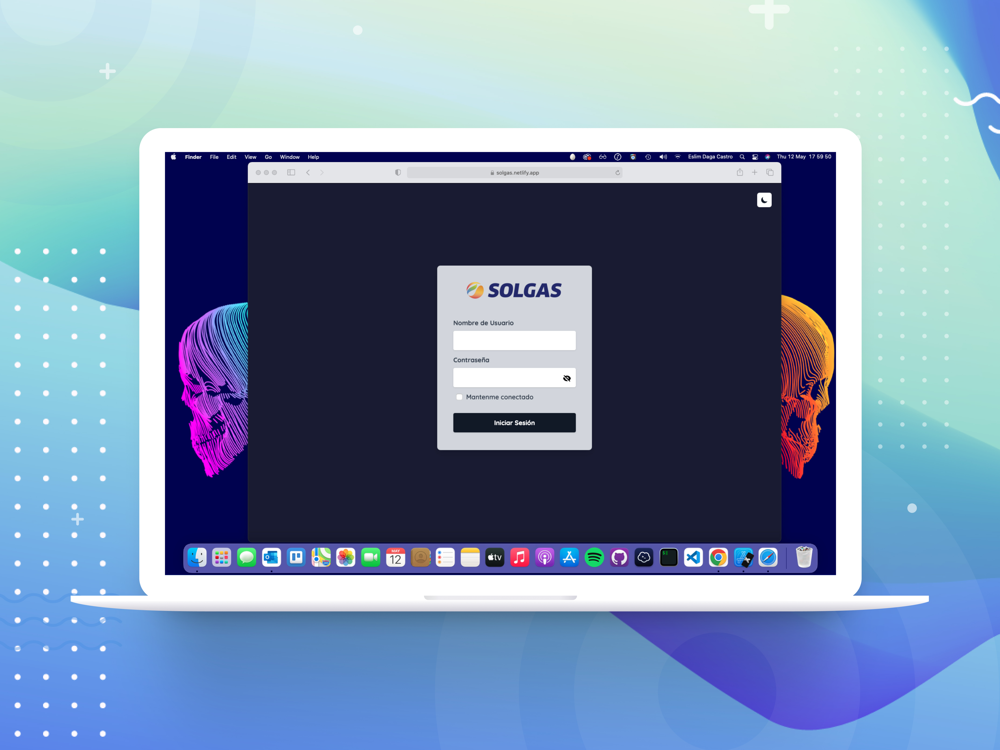

# Solgas App ☢️

This is a my personal project "Solgas App" using a private API, prepared by the company in which i am working 🛰

## Installation and Setup Instructions 💻

Clone down this repository. You will need `node` and `npm` installed globally on your machine.

Installation:

`npm install`

To Start Server:

`npm start`

To Visit App:

`localhost:3000`

## Table of contents 📄

- [Solgas App](#solgas-app-☢️)
  - [Installation](#installation-and-setup-instructions-💻)
  - [Table of contents](#table-of-contents-📄)
  - [Overview](#overview-🧩)
    - [Screenshot](#screenshot)
    - [Links](#links-🔗)
  - [My process](#my-process-📄)
    - [Built with](#built-with)
  - [Author](#author-👨🏻‍💻)

## Overview 🧩
### Screenshot

.png)

### Links 🔗

- Solution URL: [https://github.com/EslimDaga/react-solgas-app](https://github.com/EslimDaga/react-solgas-app)
- Live Site URL: [https://solgas.netlify.app/](https://solgas.netlify.app/)

## My process 📄

### Built with

- [React](https://reactjs.org/) - JS library
- [Tailwind ](https://tailwindcss.com/) - CSS framework

## Author 👨🏻‍💻

- Frontend Mentor - [@eslimdaga](https://www.frontendmentor.io/profile/eslimdaga)
- Twitter - [@eslimdaga](https://www.twitter.com/eslimdaga)